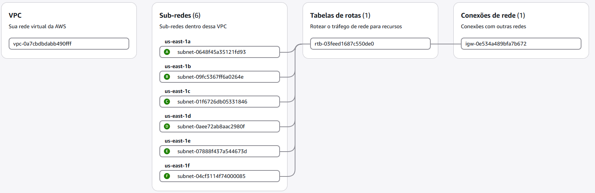
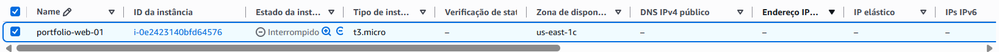
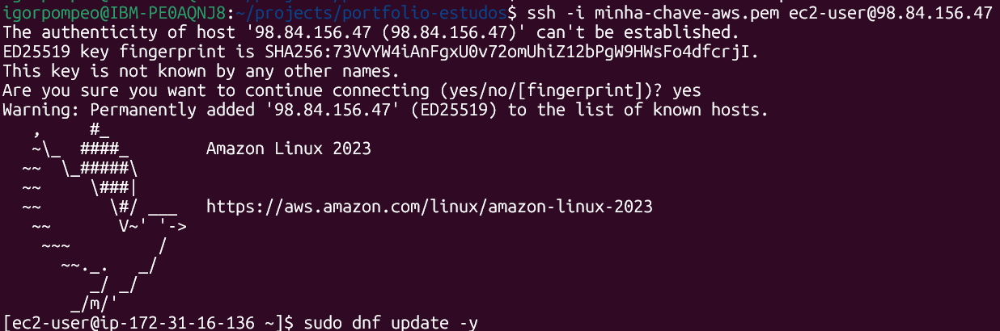
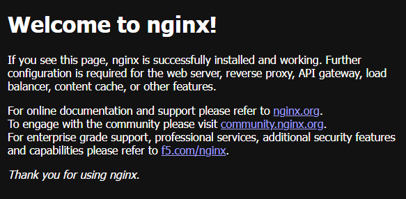

# 01 — Fundamentos AWS: VPC, EC2 e Servidor Web

## Objetivo

Entender e provisionar manualmente a infraestrutura de rede e computação
básica da AWS, como base prática antes de recriar o mesmo ambiente via
CloudFormation (módulo 02).

## O que foi feito

1. Configuração de conta AWS com boas práticas de segurança: usuário IAM
   dedicado (sem uso de root no dia a dia), MFA habilitado, Budget Alert
   (Zero-Spend) para controle de custos.
2. Exploração da VPC padrão (default) da região `us-east-1`: subnets
   distribuídas por Availability Zone, Route Table associada ao Internet
   Gateway.
3. Provisionamento de uma instância EC2 (`t3.micro`, Amazon Linux 2023)
   em subnet pública, com Security Group configurado para:
   - SSH (porta 22) restrito ao IP de origem — não aberto ao mundo.
   - HTTP (porta 80) aberto, necessário para acesso web público.
4. Conexão via SSH e instalação de servidor web (nginx), validando
   acesso via navegador pelo IP público da instância.

## Decisões técnicas

- **SSH restrito ao meu IP, não `0.0.0.0/0`**: reduz superfície de
  ataque — evita brute-force de credenciais expostas globalmente.
- **Instância parada (`Stop`) fora dos períodos de estudo**: controle
  de custo. `Stop` preserva o disco (EBS) mas não cobra por CPU
  ociosa, diferente de manter rodando 24/7.
- **`systemctl enable` além de `start`**: garante que o nginx volte a
  rodar automaticamente caso a instância seja reiniciada, sem
  intervenção manual.

## Evidências

| VPC e Subnets | Instância EC2 | Conexão SSH | Servidor rodando |
|---|---|---|---|
|  |  |  |  |

## Próximo passo

Recriar essa mesma infraestrutura (VPC, EC2, Security Group, nginx) via
CloudFormation — módulo 02.