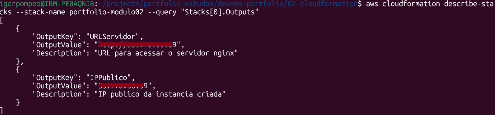
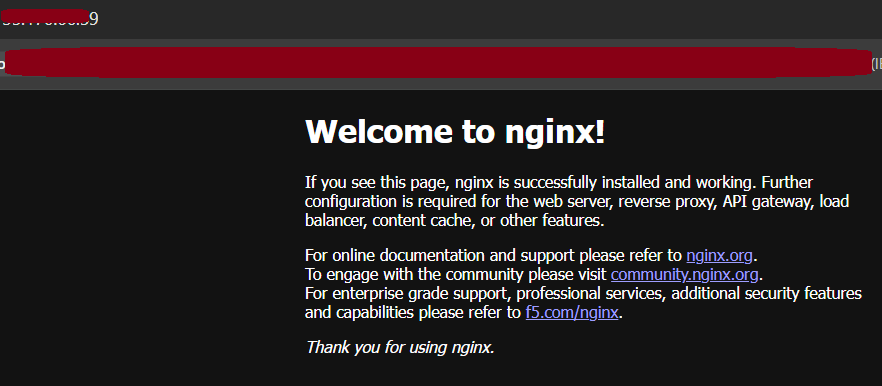

# 02 — CloudFormation: Infraestrutura como Código

## Objetivo

Recriar a infraestrutura do módulo 01 (EC2 + Security Group + nginx) de
forma declarativa via CloudFormation, substituindo o provisionamento
manual por um template reproduzível.

## O que foi feito

1. Criação de um template CloudFormation (`template.yaml`) parametrizado,
   capaz de provisionar em qualquer conta/subnet AWS sem alterar o código.
2. Definição de um Security Group via código, com as mesmas regras do
   módulo 01 (SSH restrito por IP, HTTP público).
3. Provisionamento de uma instância EC2 (`t3.micro`, Amazon Linux 2023)
   com instalação automática do nginx via `UserData` — sem necessidade
   de conexão SSH manual para configurar o servidor.
4. Deploy via AWS CLI (`aws cloudformation deploy`), validando a URL
   pública gerada nos `Outputs` do template.
5. Exclusão da stack (`delete-stack`) após validação, evitando consumo
   de recursos ociosos — toda a infraestrutura criada foi removida em
   uma única operação.

## Decisões técnicas

- **Uso de Parameters em vez de valores fixos no template**: permite que
  o mesmo `template.yaml` seja reutilizado em contas, regiões ou
  ambientes diferentes, sem editar o código — apenas os valores
  informados no deploy mudam.
- **AMI resolvida via SSM (`{{resolve:ssm:...}}`)** em vez de ID fixo:
  garante que o template sempre use a AMI mais recente do Amazon Linux
  2023 disponível, evitando quebra por descontinuação de imagem.
- **`UserData` para instalação do nginx**: substitui os comandos digitados
  manualmente via SSH no módulo 01 por um script que roda automaticamente
  no primeiro boot da instância — elimina intervenção manual.

## O que deu errado e como resolvi

Ao criar o `template.yaml` para provisionar a EC2 e o Security Group via
CloudFormation, a execução falhou com o seguinte erro:

> "The parameter groupName cannot be used with the parameter subnet"

**Causa:** o template usava `!Ref` para referenciar o Security Group
dentro de `SecurityGroupIds`. Porém, `!Ref` aplicado a um recurso do tipo
Security Group tem comportamento ambíguo — em vez de retornar o `GroupId`
(esperado por `SecurityGroupIds`), retornou o `GroupName`, o que é
incompatível quando uma Subnet é especificada explicitamente.

**Solução:** troquei `!Ref MeuSecurityGroup` pela função intrínseca
`!GetAtt MeuSecurityGroup.GroupId`, forçando a referência ao ID correto
do recurso, sem ambiguidade.

## Template

Ver [`template.yaml`](./template.yaml).

## Como executar

```bash
aws cloudformation deploy \
  --template-file template.yaml \
  --stack-name nome-da-sua-stack \
  --parameter-overrides \
    SubnetId=SEU_SUBNET_ID \
    MeuIP=SEU_IP/32 \
    NomeDaChave=NOME_DA_SUA_CHAVE
```

Para remover toda a infraestrutura criada:

```bash
aws cloudformation delete-stack --stack-name nome-da-sua-stack
```

## Evidências

| Outputs da stack | Servidor via CloudFormation |
|---|---|
|  |  |

## Próximo passo

Aplicar GitOps: pipeline que executa o deploy do template automaticamente
a partir de um push no repositório — módulo 03.