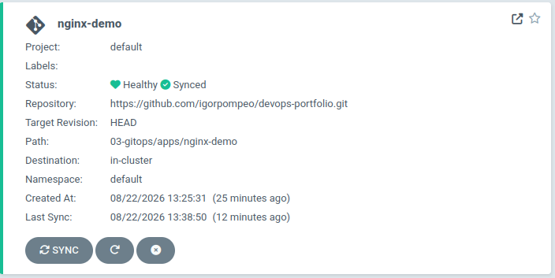
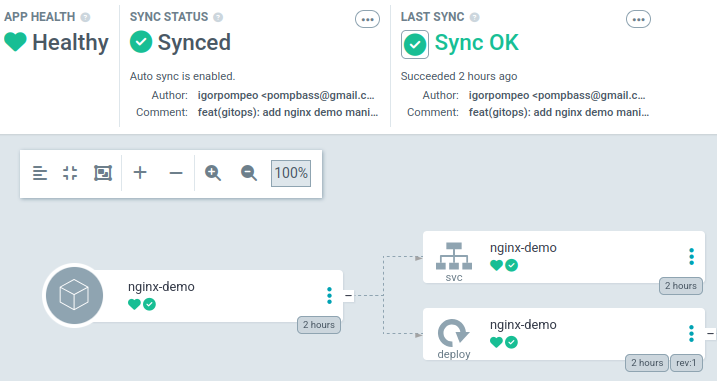

# Módulo 03 — GitOps com Argo CD

## Objetivo

Substituir o modelo push-based de CI/CD (pipeline aplica mudanças diretamente no
ambiente) por um modelo pull-based: um controlador dentro do cluster observa um
repositório Git e mantém o cluster sincronizado com o que está declarado nele.
Argo CD escolhido por exposição direta em projeto real de cliente.

## Decisões técnicas

- **Cluster local via `kind`** em vez de EKS: o foco do módulo é o mecanismo de
  reconciliação do Argo CD, não provisionamento de cluster gerenciado — já coberto
  conceitualmente no Módulo 01/02. `kind` elimina custo e tempo de setup.
- **`kubectl apply --server-side`** para instalar o Argo CD em vez do `apply`
  padrão — ver seção de erro abaixo.
- **Sync policy: Manual → Automated (com self-heal)**, nessa ordem deliberada,
  para observar e documentar a diferença de comportamento antes de ativar
  automação total.

## O que foi feito

1. Cluster Kubernetes local criado com `kind` (v0.32.0, Kubernetes v1.30.0)
2. Argo CD instalado no namespace `argocd` via manifesto oficial
3. Acesso configurado via UI (port-forward) e CLI (`argocd login`)
4. Application `nginx-demo` criada apontando para `03-gitops/apps/nginx-demo/`
   neste mesmo repositório
5. Sync manual executado — Argo CD aplicou os manifestos sem `kubectl apply`
6. Drift testado em duas fases (ver abaixo)

## Erro e solução: CRD do ApplicationSet excedendo o limite de annotation

Ao instalar o Argo CD com `kubectl apply -f install.yaml`, o CRD
`applicationsets.argoproj.io` falhou silenciosamente: The CustomResourceDefinition "applicationsets.argoproj.io" is invalid:
metadata.annotations: Too long: must have at most 262144 bytes

**Causa raiz:** `kubectl apply` grava o manifesto completo na annotation
`kubectl.kubernetes.io/last-applied-configuration`, usada para calcular diffs em
aplicações futuras. Esse CRD específico é grande o suficiente para estourar o
limite de 256KB do Kubernetes para qualquer annotation.

**Solução:** reaplicar com `--server-side`, que faz o merge no lado do servidor
em vez de depender dessa annotation:
kubectl apply -n argocd -f https://raw.githubusercontent.com/argoproj/argo-cd/stable/manifests/install.yaml --server-side

**Verificação:**
kubectl get crd | grep argoproj

## Experimento: drift e self-healing

Testado o que acontece quando o cluster diverge do Git, sob duas políticas de sync.

| | Manual | Automated + self-heal |
|---|---|---|
| Ação | `kubectl scale --replicas=3` | `kubectl scale --replicas=3` depois `5` |
| Argo CD detectou? | Sim (`OutOfSync`) | Sim |
| Argo CD corrigiu sozinho? | Não — ficou `OutOfSync` até sync manual | Sim — revertido para 1 réplica (valor do Git) em segundos, sem intervenção |

**Conclusão:** o Argo CD sempre roda o loop de comparação Git ↔ cluster,
independente da política. O que a política controla é se ele *age* sobre a
divergência detectada ou apenas a reporta. Isso separa dois conceitos que
parecem um só: "está sincronizado" (Sync Status) e "confio nisso o suficiente
pra deixar aplicar sozinho" (Sync Policy).

## Evidências





## Estrutura
03-gitops/
└── apps/
└── nginx-demo/
├── deployment.yaml
└── service.yaml

## Como reproduzir

Pré-requisitos: Docker, kubectl, e o binário `kind` instalado.

```bash
# 1. Criar o cluster local
kind create cluster --name devops-portfolio

# 2. Instalar o Argo CD (--server-side evita o erro de CRD, ver seção acima)
kubectl create namespace argocd
kubectl apply -n argocd \
  -f https://raw.githubusercontent.com/argoproj/argo-cd/stable/manifests/install.yaml \
  --server-side

# 3. Acompanhar os pods subirem
kubectl get pods -n argocd -w

# 4. Instalar o CLI argocd
curl -sSL -o argocd-linux-amd64 \
  https://github.com/argoproj/argo-cd/releases/latest/download/argocd-linux-amd64
sudo install -m 555 argocd-linux-amd64 /usr/local/bin/argocd

# 5. Abrir túnel para a UI (deixar rodando em terminal separado)
kubectl port-forward svc/argocd-server -n argocd 8080:443

# 6. Pegar senha inicial e logar
kubectl -n argocd get secret argocd-initial-admin-secret \
  -o jsonpath="{.data.password}" | base64 -d
argocd login localhost:8080 --username admin --password <senha> --insecure

# 7. Criar a Application apontando para este repositório
argocd app create nginx-demo \
  --repo https://github.com/igorpompeo/devops-portfolio.git \
  --path 03-gitops/apps/nginx-demo \
  --dest-server https://kubernetes.default.svc \
  --dest-namespace default

# 8. Sincronizar
argocd app sync nginx-demo

# 9. (Opcional) ativar sync automático + self-heal
argocd app set nginx-demo --sync-policy automated --self-heal
```